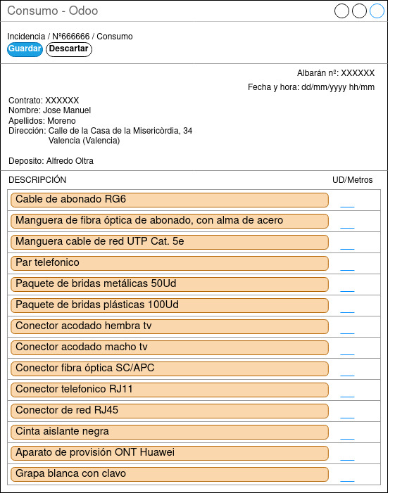

## Pantalla Nueva Incidencia

  

Esta pantalla es la cual aparece cuando el técnico hace clic sobre el botón de realizar consumo de materiales.
En ella podrá los materiales que ha utilizado en la incidencia. 
Dichos materiales son los utilizado por los técnicos por lo que unicamente deberá poner las unidades o los metros utilizados de cada material, los que no hubiere utilizado deberá dejar el campo en blanco.
Una vez terminado de cumplimentar deberá darle al botón guardar y quedará almacenado el albarán de consumo registrado en el sistema.

La única persona que puede acceder a dicha pagina será el técnico asociado a la incidencia y solamente mientras no haya guardado un albarán previamente en dicha incidencia por lo que tiene que tener especial cuidado al cumplimentarla.