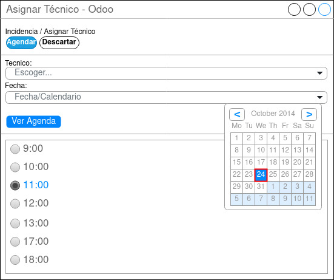

## Pantalla para Asignar Técnico a la Incidencias

  

En el caso de que el jefe técnico necesite cambiar el técnico asignado, tras hacer clic en el botón “Cambiar Técnico Asignado” aparecerá esta pantalla, en la cual podrá escoger el técnico y el día.

Una vez escogidos si le da a “Ver Agenda aparecerán los radio buttons de las franjas horarias.

Los disponibles se podrá hacer clic y los que tengan agendada alguna incidencia estarán disable (podrán verse pero no se podrán seleccionar).
Una vez escogido el técnico, la fecha y la franja horaria, tendrá que darle al botón “Agendar” par que quede guardado.