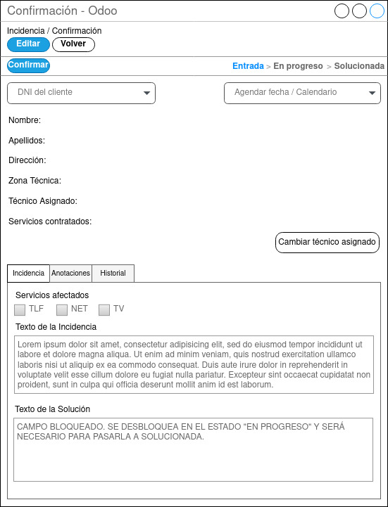

## Pantalla Confirmación de Incidencias

  

Una vez creada la incidencia aparecerá el la pantalla general de incidencias en la fase “Entrada”. Se podrá acceder a esta ventana pulsando sobre la incidencia. Tanto los usuarios con perfil CAC como con perfil Técnico podrán visualizarla pero unicamente el jefe técnico podrá confirmarla dando clic al botón Confirmar o editarla haciendo clic sobre el botón editar. 
En el caso de tener que modificar el texto de la incidencia o los servicios afectados el agente del CAC o el jefe técnico podrá darle sobre el botón editar para modificar cualquiera de esos dos campos, pero nunca podrá cambiar el DNI del cliente, porque seria una incidencia totalmente diferente por lo que en ese caso deberán solucionar la incidencia como erronea para tener un seguimiento de que ha sido un error. Ya que ninguna incidencia debe borrarse por motivos de mala praxis de la opción borrar.
Para poder confirmarla deberá estar agendada en un técnico con una fecha y hora. Para ello podrá dejarse al técnico asignado automáticamente según la zona en la que se encuentre el domicilio y escogiendo en la agenda la fecha y hora o cambiando el técnico desde el botón “Cambiar técnico asignado”.
Una vez realizado esto se podrá hacer clic sobre el botón confirmar y la incidencia pasará al estado “En Progreso”.
El campo texto de la solución en esta fase seguirá bloqueado ya que no tiene sentido en esta fase de la incidencia.

Los perfiles que tendrán acceso a esta pantalla son los siguiente:
- Usuarios con perfil CAC:
    - Consulta de la incidencias.
    - Edición de incidencia.
    - Introducción de anotaciones.
- Usuarios con perfil Técnico:
    - Consulta de la incidencias.
- Usuario con perfil Jefe Técnico:
    - Consulta de la incidencia.
    - Edición de incidencia.
    - Introducción de anotaciones.
    - Confirmación de incidencia.