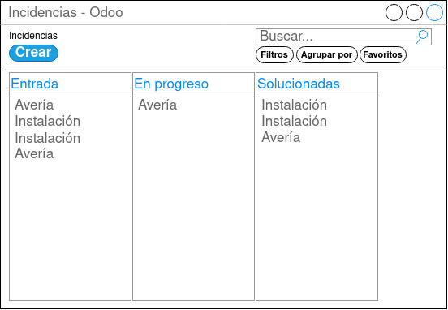

## Pantalla General de Incidencias

  

La pantalla general de incidencias es la pantalla que se muestra al entrar en el módulo. Muestra la información de incidencias que hay en diferentes estados, a ella tendrán accesos los usuarios del centro de atención al cliente, el jefe técnico y los técnicos.
La ventana debe disponer de un buscador, ya que en solucionadas van a caer todas las incidencias históricas de la empresa y será de gran ayuda para encontrar incidencias ya realizadas.

- Los usuarios con perfil CAC podrá:
    - Crear nuevas incidencias con el botón “Crear”.
    - Consultar incidencias en cualquier estado.
- Perfil Jefe Técnico:
    - Crear nuevas incidencias con el botón “Crear”.
    - Consultar incidencias en cualquier estado.
    - Cambiar los estados de las incidencias arrastrándolas.
- Perfil Técnico:
    - Consultar incidencias asociadas a dicho trabajador en cualquier estado.