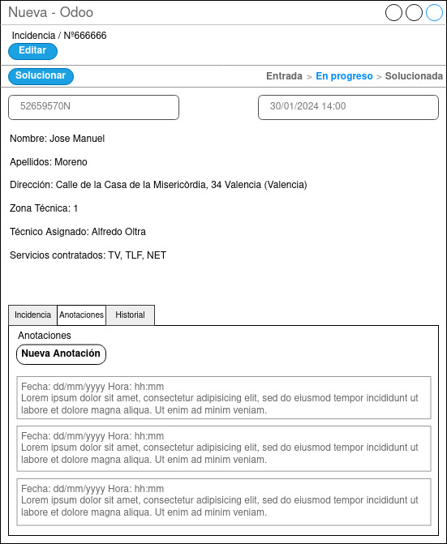

## Pantalla Incidencia En Progreso

  

Una vez confirmada la incidencia, pasará a “En Progreso”. Aparecerá en la barra de dicha fase en la pantalla general de incidencias, y al hacer clic sobre ella aparecerá esta pantalla. 
La misión de esta pantalla es poder visualizar la información, añadir nuevas anotaciones y añadir texto de la solución para finalmente poder solucionar la incidencia, haciendo clic en el botón Solucionar.
El campo texto de la solución en esta fase se desbloquea para poder aportar la solución aplicada sobre dicha incidencia.

Se podrán realizar las siguientes acciones según el perfil del empleado.
- Usuarios con perfil CAC:
    - Visualizar la incidencia.
    - Añadir nuevas anotaciones
- Usuarios con perfil Técnico:
    - Visualizar la incidencia.
    - Añadir nuevas anotaciones.
    - Añadir texto de la solución.
- Usuario con perfil Jefe Técnico:
    - Visualizar la incidencia.
    - Añadir nuevas anotaciones.
    - Añadir texto de la solución.
    - Solucionar la incidencia.