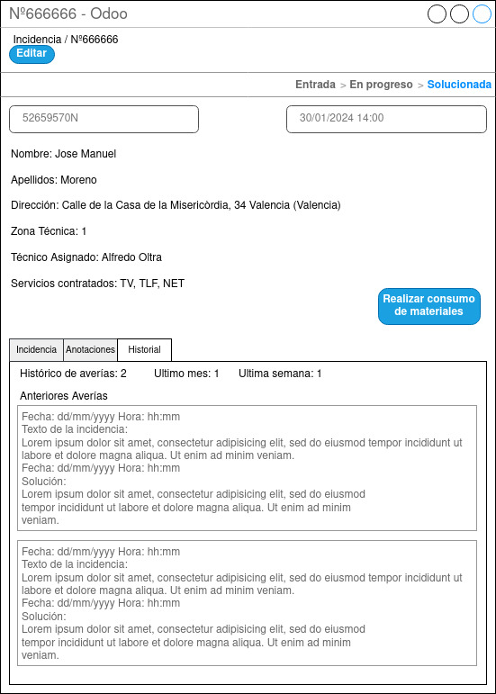

## Pantalla Nueva Incidencia

  

Una vez solucionada la incidencia pasará a dicho estado en la pantalla general de incidencias y si realizas clic sobre la incidencia concreta aparecerá esta pantalla.
Su misión principal es mantener un registro sobre todas las incidencias resueltas.
Todos los campos estarán bloqueados, aunque visibles para poder ver la información completa de la incidencia.
También dispone de un botón para realizar el consumo de materiales, unicamente tendrá disponible el botón el técnico asociado a dicha incidencia.
Una vez realizado el consumo dicho botón servirá para ver el albarán de consumo.

Se podrán realizar las siguientes acciones según el perfil del empleado.
- Usuarios con perfil CAC:
    - Visualizar la incidencia.
- Usuarios con perfil Técnico:
    - Visualizar la incidencia.
    - Acceder a la pantalla de consumo de materiales de dicha incidencia a través del botón “Realizar consumo de materiales”.
    - Acceder al albarán de consumo a través del botón “Ver albarán de consumo”, si se ha realizado.
- Usuario con perfil Jefe Técnico:
    - Visualizar la incidencia.
    - Acceder al consumo a través del botón “Ver albarán de consumo”, si se ha realizado.