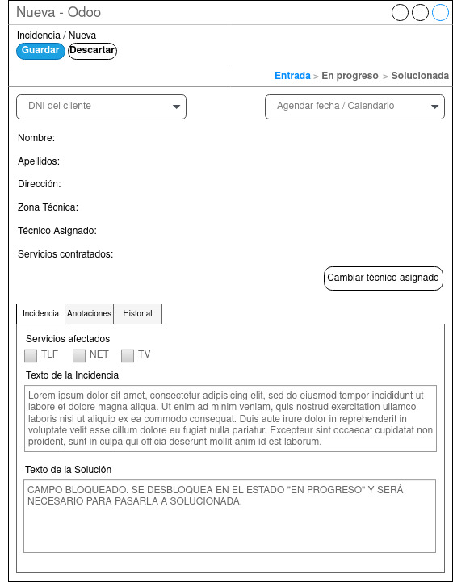

## Pantalla Nueva Incidencia

  

  
La pantalla de nueva incidencia es en la cual aparece al hacer clic sobre el botón “Crear” en la pantalla general de incidencias. El agente del CAC o jefe técnico tendrán que rellenar obligatoriamente el DNI del cliente, los servicios afectados y el texto de la incidencia. Siendo opcional agendar la fecha y hora o cambiar el técnico asignado.
Las pestañas Incidencia, Anotaciones e Historial serán accesibles desde todas las fases, pero solo será visible la información necesaria en cada fase.

* Pestaña Incidencia:
Servicios afectados es obligatorio en la creación de incidencia, una vez creada la incidencia quedará bloqueado, siendo visible los servicios que se marcaron al crear la incidencia
El campo texto de la incidencia es de obligatoria cumplimentación en esta fase y deberá escribirse el motivo por lo que el cliente se ha puesto en contacto por la empresa.
El campo texto de la solución en esta fase estará bloqueado ya que no tiene sentido en esta fase de la incidencia.

* Pestaña Anotaciones:
Esta pestaña servirá para realizar o consultar informaciones adicionales. Como por ejemplo que el cliente ha vuelto a llamar dando alguna instrucción extra. (*ver wireframe de la pantalla incidencia en progreso).

* Pestaña Historial: 
En esta pestaña se podrán consultar todas la incidencia de una manera rápida teniendo la información adicional de numero de incidencias totales, incidencias dentro del mismo mes e incidencias dentro de esta misma semana.